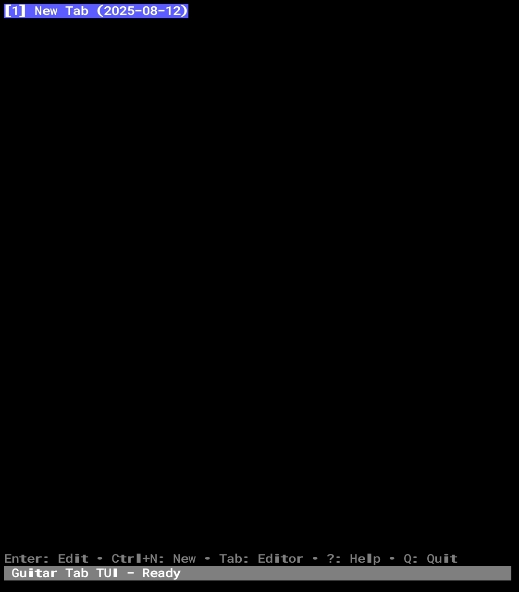
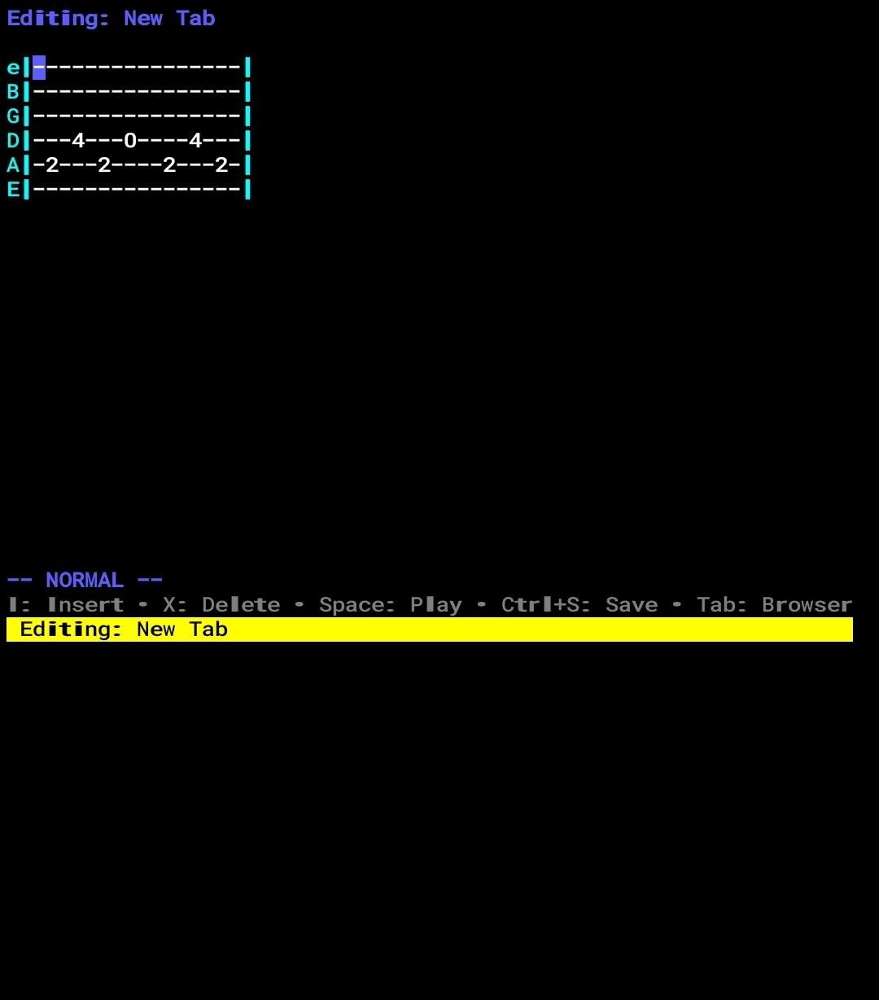

# tuitar

A terminal-based guitar tablature editor built with Go and Bubble Tea.

## Features

- **Intuitive Terminal Interface**: Vim-like keyboard navigation with modal editing
- **Real-time Tab Editing**: Create and edit guitar tabs with instant visual feedback
- **Modal Editing**: Separate Normal and Insert modes for efficient editing workflow
- **Audio Playback**: Visual highlighting during playback (audio output in development)
- **Measure Management**: Add and remove measures dynamically with smart display wrapping
- **Advanced Navigation**: Page scrolling, measure jumping, and intuitive cursor movement
- **Local Storage**: SQLite-based tab management with auto-save functionality
- **Tab Browser**: Browse, delete, and organize your tabs with easy navigation
- **Keyboard-driven**: Efficient workflows without mouse dependency
- **Cross-platform**: Pre-built binaries for Windows, Linux, and Android

## Screenshots

<p float="left">
  
  
</p>

## Installation

### Pre-built Binaries (Recommended)

Download the latest release for your platform:

- **Windows AMD64**: [tuitar-windows-amd64.exe](https://github.com/Cod-e-Codes/tuitar/releases/latest/download/tuitar-windows-amd64.exe)
- **Linux AMD64**: [tuitar-linux-amd64](https://github.com/Cod-e-Codes/tuitar/releases/latest/download/tuitar-linux-amd64)
- **Android ARM64**: [tuitar-android-arm64](https://github.com/Cod-e-Codes/tuitar/releases/latest/download/tuitar-android-arm64)

### From Source

```bash
# Install from source
git clone https://github.com/Cod-e-Codes/tuitar
cd tuitar
go build -o tuitar
```
```bash
# Or install directly
go install github.com/Cod-e-Codes/tuitar@latest
```

## Usage

```bash
# Start the application
./tuitar

# The application will create a tabs.db SQLite database in the current directory
```

## Key Bindings

### Global
- `q` / `Ctrl+C` - Quit application
- `?` - Toggle help
- `Ctrl+N` - Create new tab
- `Ctrl+S` - Save current tab

### Browser Mode
- `j` / `↓` - Move down
- `k` / `↑` - Move up
- `Enter` - Edit selected tab
- `d` - Delete selected tab

### Editor Mode (Normal)
- `h` / `←` - Move cursor left
- `j` / `↓` - Move cursor down (to next string)
- `k` / `↑` - Move cursor up (to previous string)
- `l` / `→` - Move cursor right
- `w` - Move to next measure boundary
- `b` - Move to previous measure boundary
- `g` - Move to beginning of current measure
- `$` - Move to end of current measure
- `Home` - Move to beginning of string
- `End` - Move to end of string
- `PgUp` / `PgDn` - Page up/down scrolling
- `x` - Delete fret (replace with dash)
- `Space` - Play/pause tab
- `m` - Add new measure
- `M` - Remove last measure
- `i` - Switch to insert mode
- `Tab` - Return to browser
- `Esc` - Stay in normal mode

### Editor Mode (Insert)
- `0-9` - Insert fret number (auto-advances cursor)
- `-` - Insert rest/dash (auto-advances cursor)
- `Backspace` - Delete previous character and move back
- `Arrow keys` / `hjkl` - Navigate while in insert mode
- `Esc` - Return to normal mode

## Editing Workflow

Tuitar uses a modal editing system inspired by Vim:

1. **Normal Mode** (default): Navigate and perform editing commands
   - Use arrow keys or `hjkl` to move the cursor
   - Press `i` to enter Insert mode at the current position
   - Press `x` to delete the fret number at cursor (replaces with `-`)

2. **Insert Mode**: Type fret numbers and navigate
   - Type `0-9` to insert fret numbers
   - Type `-` to insert rests
   - The cursor automatically advances after inserting
   - Use `Backspace` to delete and move backward
   - Press `Esc` to return to Normal mode

3. **Visual Feedback**: 
   - Current cursor position is highlighted
   - Insert mode shows with yellow highlighting
   - Normal mode shows with blue highlighting
   - Mode indicator shows current editing mode

## Project Structure

The application follows a clean architecture pattern:

- `internal/models/` - Core data structures and business logic
- `internal/storage/` - Data persistence layer (SQLite)
- `internal/ui/` - Bubble Tea UI components and views  
- `internal/midi/` - MIDI playback functionality (basic implementation)

## Building from Source

```bash
# Clone the repository
git clone https://github.com/Cod-e-Codes/tuitar
cd tuitar
```

```bash
# Install dependencies
go mod tidy
```

```bash
# Build
go build -o tuitar
```

```bash
# Run
./tuitar
```

## Dependencies

- [Bubble Tea](https://github.com/charmbracelet/bubbletea) - TUI framework
- [Bubbles](https://github.com/charmbracelet/bubbles) - TUI components
- [Lipgloss](https://github.com/charmbracelet/lipgloss) - Terminal styling
- [SQLite](https://github.com/mattn/go-sqlite3) - Local database
- [Beep](https://github.com/faiface/beep) - Audio playback library

## Tips & Tricks

- **Quick Start**: Press `Ctrl+N` to create a new tab and start editing immediately
- **Save Often**: Use `Ctrl+S` to save your work - changes are highlighted when unsaved
- **Navigation**: Use `hjkl` keys for faster navigation without leaving home row
- **Measure Navigation**: Use `w`/`b` to jump between measures, `g`/`$` for measure boundaries
- **Page Scrolling**: Use `PgUp`/`PgDn` for fast scrolling through long tabs
- **Measure Management**: Use `m` to add measures, `M` to remove them - they display side by side
- **Insert Flow**: In Insert mode, type fret numbers quickly - the cursor advances automatically
- **Error Correction**: Use `x` in Normal mode for quick deletions, or `Backspace` in Insert mode
- **Mode Awareness**: Watch the mode indicator to know which editing mode you're in
- **Tab Management**: Use `d` in browser mode to delete unwanted tabs

## Contributing

1. Fork the repository
2. Create a feature branch
3. Make your changes
4. Add tests if applicable
5. Submit a pull request

## License

MIT License - see LICENSE file for details

## Releases

Check out the [Releases page](https://github.com/Cod-e-Codes/tuitar/releases) for the latest version and changelog.

### Current Release: v1.0.0

- ✅ Cross-platform builds (Windows, Linux, Android)
- ✅ Modal editing with Vim-like navigation
- ✅ Measure management and advanced navigation
- ✅ Visual playback highlighting
- ✅ Tab browser with delete functionality
- ✅ SQLite-based local storage

## Roadmap

- [x] Visual playback highlighting (using Beep library)
- [x] Measure management (add/remove measures dynamically)
- [x] Advanced navigation (page scrolling, measure jumping)
- [x] Tab deletion functionality
- [ ] Audio output (visual playback works, but no sound yet)
- [ ] Advanced tab notation (bends, slides, hammer-ons, pull-offs)
- [ ] Multi-instrument support (bass, drums, etc.)
- [ ] Tab sharing
